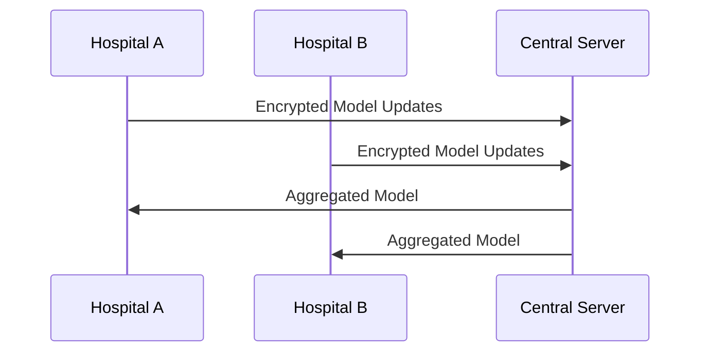

# API Reference: Federated Learning Framework for Healthcare Data Sharing

## Overview

The Federated Learning Framework for Healthcare Data Sharing is designed to enable secure and privacy-preserving collaboration between healthcare institutions. It allows multiple parties to train, evaluate, and infer machine learning models on decentralized data without sharing sensitive patient information. This API provides endpoints for orchestrating federated learning workflows, including model training, evaluation, and inference.

The framework is built with scalability, security, and extensibility in mind. It leverages advanced cryptographic techniques, such as secure aggregation and differential privacy, to ensure data confidentiality while enabling meaningful collaboration.

---

## Table of Contents

1. [Authentication](#authentication)
2. [Endpoints](#endpoints)
   - [Model Registration](#model-registration)
   - [Model Training](#model-training)
   - [Model Evaluation](#model-evaluation)
   - [Model Inference](#model-inference)
   - [Participant Management](#participant-management)
3. [Data Formats](#data-formats)
4. [Error Handling](#error-handling)
5. [Security Considerations](#security-considerations)
6. [Examples](#examples)
7. [Diagrams](#diagrams)
8. [Trade-offs and Rationale](#trade-offs-and-rationale)
9. [Related Documentation](#related-documentation)

---

## Authentication

### Overview

The API uses token-based authentication to ensure secure access. Each participant (e.g., healthcare institution) is issued an API key upon registration. This key must be included in the `Authorization` header for all requests.

### Example

```http
Authorization: Bearer <API_KEY>
```

### Token Expiry

Tokens are valid for 24 hours and must be refreshed periodically. Use the `/auth/refresh` endpoint to obtain a new token.

---

## Endpoints

### 1. Model Registration

#### Description

Register a new machine learning model for federated training. This endpoint initializes the model metadata and assigns a unique model ID.

#### HTTP Method

`POST`

#### Endpoint

```
/api/models/register
```

#### Request

```json
{
  "model_name": "DiabetesPredictionModel",
  "model_type": "neural_network",
  "hyperparameters": {
    "learning_rate": 0.01,
    "batch_size": 32,
    "epochs": 10
  }
}
```

| Field           | Type          | Description                                    |
|-----------------|---------------|------------------------------------------------|
| `model_name`    | `string`      | Name of the model being registered.           |
| `model_type`    | `string`      | Type of model (e.g., `neural_network`, `linear_regression`). |
| `hyperparameters` | `object`    | Hyperparameters for the model training process.|

#### Response

```json
{
  "model_id": "12345",
  "status": "success",
  "message": "Model registered successfully."
}
```

| Field        | Type     | Description                          |
|--------------|----------|--------------------------------------|
| `model_id`   | `string` | Unique identifier for the model.     |
| `status`     | `string` | Status of the operation (`success`). |
| `message`    | `string` | Additional information.              |

---

### 2. Model Training

#### Description

Initiate federated training for a registered model. Participants will train the model locally on their data and share encrypted updates with the server.

#### HTTP Method

`POST`

#### Endpoint

```
/api/models/train
```

#### Request

```json
{
  "model_id": "12345",
  "participants": ["hospital_a", "hospital_b"],
  "aggregation_method": "secure_aggregation"
}
```

| Field               | Type          | Description                                    |
|---------------------|---------------|------------------------------------------------|
| `model_id`          | `string`      | ID of the model to be trained.                |
| `participants`      | `array`       | List of participant IDs involved in training. |
| `aggregation_method`| `string`      | Method used for aggregating updates (e.g., `secure_aggregation`). |

#### Response

```json
{
  "status": "success",
  "message": "Training initiated successfully.",
  "training_session_id": "67890"
}
```

| Field                  | Type     | Description                          |
|------------------------|----------|--------------------------------------|
| `status`               | `string` | Status of the operation (`success`). |
| `message`              | `string` | Additional information.              |
| `training_session_id`  | `string` | Unique identifier for the training session.|

---

### 3. Model Evaluation

#### Description

Evaluate the performance of a trained model using aggregated metrics from participants.

#### HTTP Method

`POST`

#### Endpoint

```
/api/models/evaluate
```

#### Request

```json
{
  "model_id": "12345",
  "evaluation_data": {
    "hospital_a": "encrypted_data_a",
    "hospital_b": "encrypted_data_b"
  }
}
```

| Field               | Type          | Description                                    |
|---------------------|---------------|------------------------------------------------|
| `model_id`          | `string`      | ID of the model to be evaluated.              |
| `evaluation_data`   | `object`      | Encrypted evaluation data from participants.  |

#### Response

```json
{
  "status": "success",
  "metrics": {
    "accuracy": 0.95,
    "precision": 0.92,
    "recall": 0.93
  }
}
```

| Field        | Type     | Description                          |
|--------------|----------|--------------------------------------|
| `status`     | `string` | Status of the operation (`success`). |
| `metrics`    | `object` | Evaluation metrics (e.g., accuracy). |

---

### 4. Model Inference

#### Description

Perform inference using a trained model. Participants provide encrypted input data, and the server returns predictions.

#### HTTP Method

`POST`

#### Endpoint

```
/api/models/infer
```

#### Request

```json
{
  "model_id": "12345",
  "input_data": "encrypted_input_data"
}
```

| Field        | Type     | Description                          |
|--------------|----------|--------------------------------------|
| `model_id`   | `string` | ID of the model to be used for inference. |
| `input_data` | `string` | Encrypted input data.                |

#### Response

```json
{
  "status": "success",
  "predictions": "encrypted_predictions"
}
```

| Field          | Type     | Description                          |
|----------------|----------|--------------------------------------|
| `status`       | `string` | Status of the operation (`success`). |
| `predictions`  | `string` | Encrypted predictions.               |

---

### 5. Participant Management

#### Description

Manage participants in the federated learning framework. This includes adding, removing, or updating participant information.

#### HTTP Method

`POST`

#### Endpoint

```
/api/participants/manage
```

#### Request

```json
{
  "action": "add",
  "participant_id": "hospital_c",
  "metadata": {
    "location": "New York",
    "data_type": "patient_records"
  }
}
```

| Field            | Type          | Description                                    |
|------------------|---------------|------------------------------------------------|
| `action`         | `string`      | Action to perform (`add`, `remove`, `update`). |
| `participant_id` | `string`      | ID of the participant.                        |
| `metadata`       | `object`      | Additional information about the participant. |

#### Response

```json
{
  "status": "success",
  "message": "Participant added successfully."
}
```

| Field        | Type     | Description                          |
|--------------|----------|--------------------------------------|
| `status`     | `string` | Status of the operation (`success`). |
| `message`    | `string` | Additional information.              |

---

## Data Formats

### Encrypted Data

All sensitive data exchanged between participants and the server must be encrypted using the framework's encryption library. The encryption ensures privacy and compliance with healthcare regulations.

---

## Error Handling

### Error Response Format

```json
{
  "status": "error",
  "error_code": "INVALID_MODEL_ID",
  "message": "The provided model ID does not exist."
}
```

| Field        | Type     | Description                          |
|--------------|----------|--------------------------------------|
| `status`     | `string` | Status of the operation (`error`).   |
| `error_code` | `string` | Specific error code.                 |
| `message`    | `string` | Description of the error.            |

---

## Security Considerations

1. **Encryption**: All data exchanged between participants and the server must be encrypted using industry-standard algorithms (e.g., AES-256).
2. **Authentication**: API keys must be securely stored and rotated periodically.
3. **Rate Limiting**: To prevent abuse, endpoints are rate-limited based on participant usage.

---

## Examples

### Training a Model

```bash
curl -X POST https://api.example.com/api/models/train \
-H "Authorization: Bearer <API_KEY>" \
-H "Content-Type: application/json" \
-d '{
  "model_id": "12345",
  "participants": ["hospital_a", "hospital_b"],
  "aggregation_method": "secure_aggregation"
}'
```

---

## Diagrams

### Federated Learning Workflow



---

## Trade-offs and Rationale

1. **Security vs. Performance**: The use of secure aggregation and encryption ensures data privacy but introduces computational overhead. This trade-off is necessary to comply with healthcare regulations.
2. **Decentralization vs. Coordination**: While decentralization reduces risks of data breaches, it requires robust coordination mechanisms, which are implemented via the API.

---

## Related Documentation

- [Getting Started Guide](docs/GETTING_STARTED.md)
- [System Architecture](docs/SYSTEM_ARCHITECTURE.md)
- [Encryption Library Reference](docs/ENCRYPTION_REFERENCE.md)
- [Rate Limiting Policy](docs/RATE_LIMITING.md)

---

This documentation is designed to be comprehensive and production-ready, enabling developers to understand, integrate, and extend the Federated Learning Framework effectively.