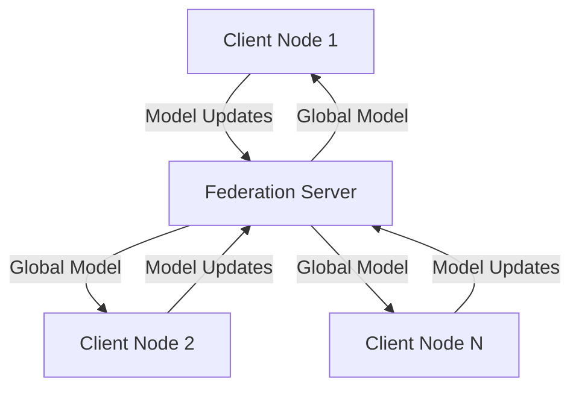
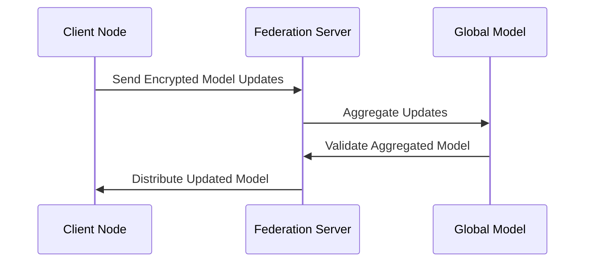

# ARCHITECTURE.md

## Federated Learning Framework for Healthcare Data Sharing

### Overview

The Federated Learning Framework for Healthcare Data Sharing is designed to enable secure, privacy-preserving machine learning across distributed healthcare institutions. The system allows institutions to collaboratively train machine learning models without sharing sensitive patient data, adhering to strict regulatory requirements such as HIPAA and GDPR.

This document provides a detailed description of the system architecture, including module boundaries, data flow, scaling strategies, trade-offs, and rationale behind design decisions. It is intended to serve as a comprehensive guide for developers, architects, and stakeholders to understand, extend, and maintain the framework.

---

## Table of Contents

1. [System Goals](#system-goals)
2. [High-Level Architecture](#high-level-architecture)
3. [Module Boundaries](#module-boundaries)
4. [Data Flow](#data-flow)
5. [Scaling Strategies](#scaling-strategies)
6. [Trade-offs and Rationale](#trade-offs-and-rationale)
7. [Diagrams](#diagrams)
8. [Examples](#examples)
9. [Related Documentation](#related-documentation)

---

## System Goals

The primary goals of the Federated Learning Framework are:

1. **Privacy Preservation**: Ensure that sensitive healthcare data remains local to the institutions and is never shared directly.
2. **Scalability**: Support large-scale deployments across hundreds or thousands of institutions.
3. **Interoperability**: Provide a modular design that integrates seamlessly with existing healthcare systems and machine learning pipelines.
4. **Robustness**: Handle unreliable network connections and ensure fault tolerance.
5. **Regulatory Compliance**: Adhere to healthcare data regulations such as HIPAA, GDPR, and other regional standards.

---

## High-Level Architecture

The system is divided into three main layers:

1. **Client Layer**: Runs locally at each healthcare institution. Responsible for data preprocessing, local model training, and secure communication with the central server.
2. **Federation Server Layer**: Coordinates the federated learning process, aggregates model updates, and ensures secure communication between clients.
3. **Global Model Layer**: Maintains the global model, performs aggregation, and distributes updates to clients.

### Key Components

- **Client Nodes**: Local systems at healthcare institutions that train models on local data.
- **Federation Server**: A central server that orchestrates the federated learning process.
- **Secure Communication Protocol**: Ensures encrypted communication between clients and the server.
- **Model Aggregator**: Aggregates local model updates into a global model.
- **Monitoring and Logging**: Tracks system performance and ensures compliance with regulations.

---

## Module Boundaries

### Client Layer

**Responsibilities**:
- Data preprocessing (e.g., normalization, feature extraction).
- Local model training using institution-specific data.
- Secure transmission of model updates to the Federation Server.

**Key Interfaces**:
- **Data Preprocessor**: Converts raw healthcare data into a format suitable for training.
- **Local Trainer**: Executes training using local data.
- **Communication Module**: Handles secure communication with the Federation Server.

---

### Federation Server Layer

**Responsibilities**:
- Orchestrates the federated learning process.
- Aggregates model updates from clients.
- Distributes the updated global model to clients.

**Key Interfaces**:
- **Model Aggregator**: Implements aggregation algorithms (e.g., Federated Averaging).
- **Client Manager**: Tracks connected clients and manages communication.
- **Security Module**: Ensures encryption and authentication.

---

### Global Model Layer

**Responsibilities**:
- Maintains the global model.
- Validates aggregated updates for consistency and quality.
- Provides APIs for external systems to query the global model.

**Key Interfaces**:
- **Model Storage**: Persists the global model.
- **Validation Engine**: Ensures the integrity of aggregated updates.
- **API Gateway**: Exposes the global model for external use.

---

## Data Flow

### Step-by-Step Process

1. **Initialization**:
   - The Federation Server initializes the global model and distributes it to all clients.
   - Clients preprocess their local data.

2. **Local Training**:
   - Each client trains the model locally using its institution-specific data.
   - The trained model weights are encrypted and sent to the Federation Server.

3. **Aggregation**:
   - The Federation Server aggregates the encrypted model updates using Federated Averaging or other algorithms.
   - The aggregated global model is validated and updated.

4. **Distribution**:
   - The updated global model is distributed back to the clients.
   - The process repeats for the next training round.

---

## Scaling Strategies

### Horizontal Scaling

- **Client Nodes**: Add more client nodes to support additional healthcare institutions.
- **Federation Server**: Use a distributed architecture with load balancers to handle increased traffic.

### Vertical Scaling

- **Federation Server**: Increase server capacity (CPU, memory, storage) to handle larger models and more clients.

### Optimization Techniques

- **Model Compression**: Reduce the size of model updates to minimize network bandwidth usage.
- **Asynchronous Updates**: Allow clients to send updates independently, reducing synchronization overhead.
- **Caching**: Cache frequently accessed data to improve performance.

---

## Trade-offs and Rationale

### Privacy vs Performance

- **Trade-off**: Encrypting model updates ensures privacy but increases computational overhead.
- **Rationale**: Privacy is a non-negotiable requirement in healthcare; performance optimizations (e.g., model compression) mitigate the overhead.

### Centralized vs Decentralized Aggregation

- **Trade-off**: Centralized aggregation simplifies coordination but introduces a single point of failure.
- **Rationale**: A centralized server is easier to manage and scale. Fault tolerance mechanisms (e.g., backups, replication) mitigate risks.

### Model Complexity vs Scalability

- **Trade-off**: Complex models may improve accuracy but require more resources, limiting scalability.
- **Rationale**: The framework supports modular model design, allowing institutions to choose models that balance accuracy and resource constraints.

---

## Diagrams

### High-Level Architecture Diagram (Mermaid)

### Data Flow Diagram (Mermaid)

---

## Examples

### Example: Adding a New Client

1. Deploy the Client Layer at the new institution.
2. Configure the Communication Module with the Federation Server's endpoint.
3. Preprocess local data using the Data Preprocessor.
4. Start local training and participate in the federated learning process.

---

## Related Documentation

- [SECURITY.md](docs/SECURITY.md): Details on encryption, authentication, and regulatory compliance.
- [API_REFERENCE.md](docs/API_REFERENCE.md): Documentation for the API Gateway.
- [DEPLOYMENT_GUIDE.md](docs/DEPLOYMENT_GUIDE.md): Instructions for deploying the framework.
- [SCALING_GUIDE.md](docs/SCALING_GUIDE.md): Best practices for scaling the system.

---

## Conclusion

This architecture provides a robust, scalable, and privacy-preserving solution for federated learning in healthcare. By adhering to industry best practices and regulatory requirements, the framework enables secure collaboration across institutions while maintaining the confidentiality of sensitive patient data.